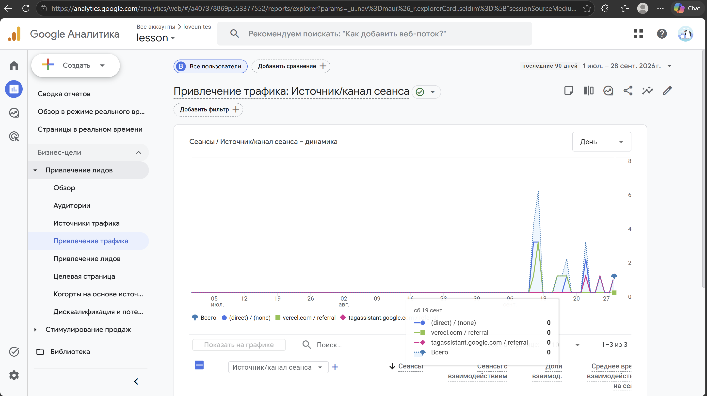
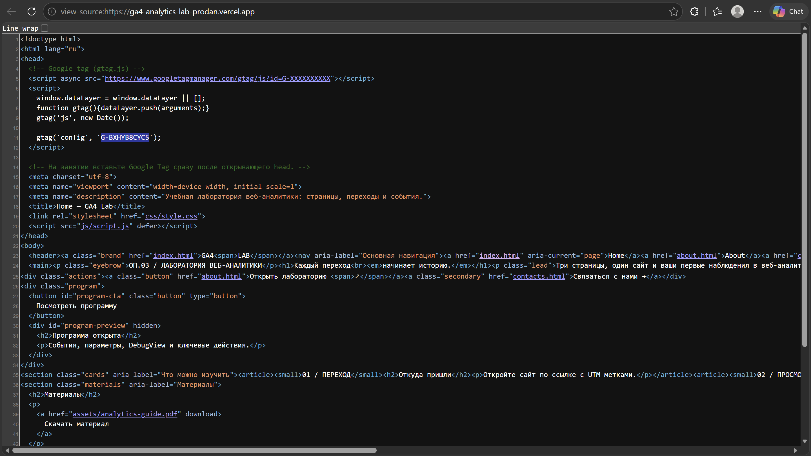
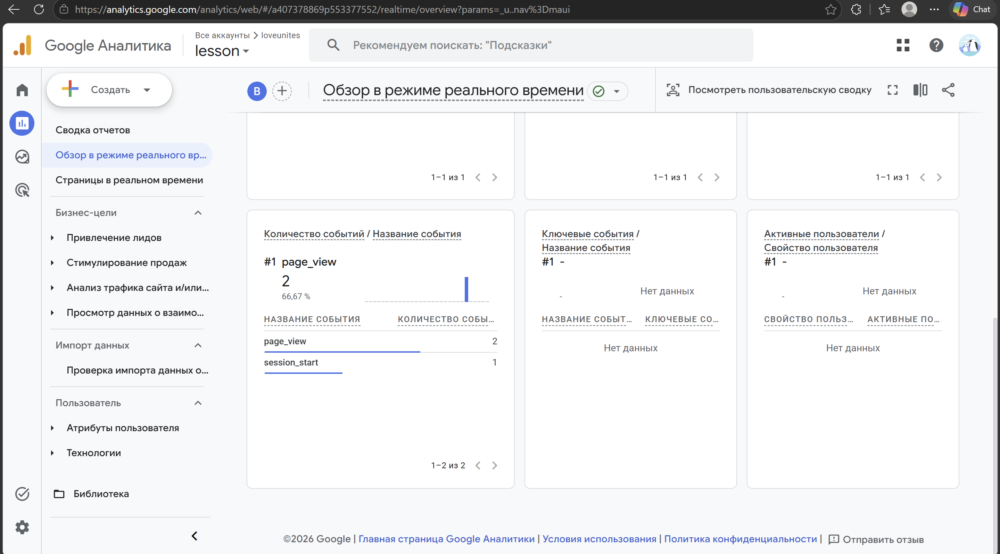

# Домашняя работа № 3 · Тег на сайте, источник и отчёты GA4

**Дисциплина:** ОП.03 «Информационные технологии»

| Поле | Значение |
|---|---|
| Фамилия, имя, отчество | Продан Илья Олегович |
| Группа | РПО/1 |
| Номер работы | 3 |
| Тема работы | Установка Google Tag, источник перехода и отчёты GA4 |
| Дата сдачи | 29.09.2026 |
| Ветка | `hw-03` |

---

## 1. Мой сайт и мой ресурс

| Поле | Значение |
|---|---|
| Адрес репозитория сайта | https://github.com/loveunites/analytics_lab |
| Публичный адрес сайта | https://ga4-analytics-lab-prodan.vercel.app/ |
| Статус публикации | Сайт доступен; статус Ready в Vercel отдельным кадром не подтверждён |
| Analytics Account | loveunites |
| Property | lesson |
| Stream name | GA4 Analytics Lab — Prodan |
| Website URL в потоке | https://ga4-analytics-lab-prodan.vercel.app/ |
| Measurement ID (`G-…`) | `G-BXHYB8CYC5` |
| Страницы с тегом | Главная страница подтверждена кадром 2; остальные страницы не проверены |

Тег ставится на каждую страницу по одному разу: две копии дают двойные
события.

## 2. Тег установлен

**Результат проверки из инструкции тега:**

> Tag Assistant обнаружил Google Tag на сайте и показал `G-BXHYB8CYC5`.



Текущий кадр 1 показывает отчёт по источникам, а не сообщение об обнаружении тега. Сообщение об обнаружении тега видно на кадре 4.



## 3. События доходят до аналитики

| Поле | Значение |
|---|---|
| Дата и время проверки | Требуется уточнить время снимка |
| Какие страницы открывали | Главная страница сайта |
| Какие события появились в Realtime | `page_view` — 2; `session_start` — 1 |
| Число активных пользователей в момент проверки | На приложенном кадре число не видно |



## 4. Источник перехода определился

Ссылка собирается с метками `utm_source`, `utm_medium`, `utm_campaign`
и открывается на своём сайте.

**Ссылка целиком:**

```text
https://ga4-analytics-lab-prodan.vercel.app/?utm_source=telegram&utm_medium=social&utm_campaign=ga4_lab
```

| Поле | Значение |
|---|---|
| Где в GA4 виден источник | Требуется кадр отчёта «Привлечение трафика» с измерением «Источник/канал сеанса» |
| Какое значение источника показал GA4 | Не подтверждено приложенным кадром |
| Совпадает с `utm_source` из ссылки | Пока не проверено |


## 5. Статистика на странице «Отчёты»

| Показатель | Значение | Период |
|---|---|---|
| Пользователи | Требуется отчёт | Требуется указать период |
| Сеансы | Требуется отчёт | Требуется указать период |
| События | Требуется отчёт | Требуется указать период |
| Самое частое событие | Требуется отчёт | Требуется указать период |


## 6. Что не получилось

Если какой-то шаг не заработал, напишите какой, какое сообщение показал сервис
и что было проверено по таблице из `README.md`. Незаполненный раздел означает,
что всё получилось.


## 7. Использование ИИ


| Вопрос | Ответ |
|---|---|
| Что сделано самостоятельно | Установка и проверка тега, открытие сайта, получение скриншотов GA4 |

