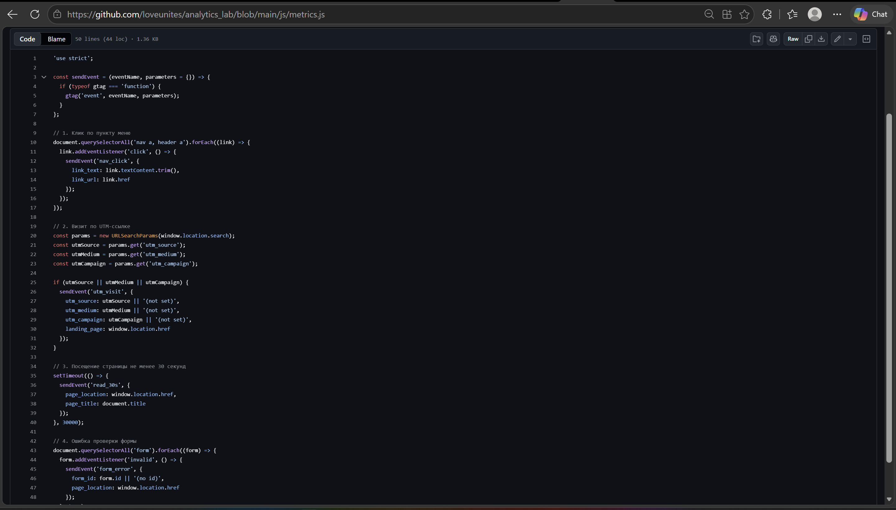
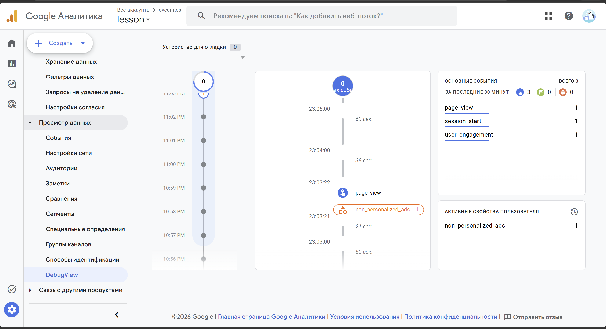
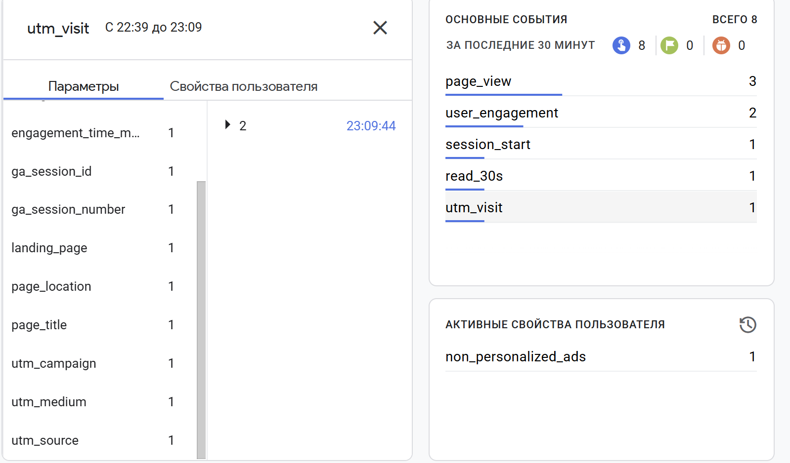
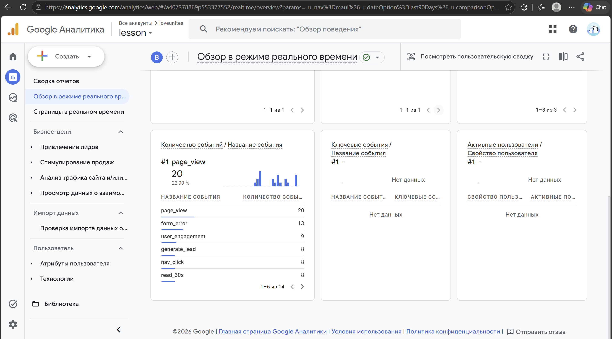

# Домашняя работа № 4 · Свои события и параметры в GA4

**Дисциплина:** ОП.03 «Информационные технологии»

| Поле | Значение |
|---|---|
| Фамилия, имя, отчество | Продан Илья Олегович |
| Группа | РПО/1 |
| Номер работы | 4 |
| Тема работы | Свои события и параметры: четыре метрики на сайте |
| Дата сдачи | 29.09.2026 |
| Ветка | `hw-04` |

---

## 1. Мой сайт и мой ресурс

| Поле | Значение |
|---|---|
| Публичный адрес сайта | https://ga4-analytics-lab-prodan.vercel.app/ |
| Measurement ID (`G-…`) | `G-BXHYB8CYC5` |
| Коммит с метриками (ссылка или первые 7 символов) | Коммит сделан пользователем на GitHub; хеш не предоставлен |
| Статус публикации | События с сайта видны в Realtime; статус Ready отдельным кадром не подтверждён |
| Страницы, где подключён `js/metrics.js` | Требуется проверить HTML-страницы; кадр 1 показывает только файл JavaScript |

Файл подключается после основного скрипта и на каждой странице по одному
разу: два подключения дают двойные события.

## 2. Какие метрики добавлены

| Событие | Что измеряет | Что делали, чтобы оно сработало |
|---|---|---|
| `nav_click` | клики по пунктам меню | Нажали пункт меню; событие видно в Realtime |
| `utm_visit` | метки кампании из адреса | Открыли сайт по ссылке с UTM; событие видно на кадре DebugView |
| `read_30s` | полминуты на странице | Оставались на странице не менее 30 секунд; событие видно в Realtime |
| `form_error` | форма не прошла проверку браузера | Попытались отправить форму с незаполненным обязательным полем; событие видно в Realtime |




## 3. События в DebugView

| Поле | Значение |
|---|---|
| Дата и время проверки | 29.09.2026, около 23:09 по времени на кадре |
| Как подключали отладку | Tag Assistant (по сообщению пользователя); способ не виден на кадре |
| Какие из четырёх событий пришли | `utm_visit` и `read_30s` видны на кадре 3; `nav_click` и `form_error` видны в Realtime на кадре 4 |
| Какие не пришли и почему | Кадр 2 снят до появления новых событий; причину установить нельзя |



## 4. Параметры события `utm_visit`

**Ссылка, по которой открывали сайт:**

```text
https://ga4-analytics-lab-prodan.vercel.app/?utm_source=telegram&utm_medium=social&utm_campaign=ga4_lab
```

| Параметр | Значение в ссылке | Значение в GA4 |
|---|---|---|
| `utm_source` | `telegram` | Название параметра видно; значение не раскрыто |
| `utm_medium` | `social` | Название параметра видно; значение не раскрыто |
| `utm_campaign` | `ga4_lab` | Название параметра видно; значение не раскрыто |
| `landing_page` | — | Название параметра видно; значение не раскрыто |




## 5. Событие вне отладки

| Поле | Значение |
|---|---|
| Где проверяли | Realtime |
| Какое событие искали | `form_error`, `nav_click`, `read_30s` |
| Сколько срабатываний показал экран | По 13, 8 и 8 соответственно |
| Период (для отчёта) | Последние 30 минут |



## 6. Что эти метрики показывают про сайт

Два-три предложения: что вы узнали о поведении посетителей из четырёх
новых событий. Например, по каким пунктам меню ходят чаще, доходит ли
кто-то до получаса чтения, спотыкается ли форма.

> За последние 30 минут на кадре видно 8 кликов по меню и 8 срабатываний `read_30s`. Форма вызвала 13 событий `form_error`; без числа попыток отправки нельзя определить долю ошибок. Частоту кликов по отдельным пунктам этот кадр не показывает.

## 7. Что не получилось

Если какая-то метрика не заработала, напишите какая, что показывал экран
и что было проверено по таблице из `README.md`. Незаполненный раздел
означает, что всё получилось.

> Кадр 2 не показывает четыре новых события в ленте DebugView; кадр 3 показывает `utm_visit`, но без раскрытых значений параметров. Кадр 1 не подтверждает подключение файла в HTML. Проверка этих пунктов по имеющимся кадрам неполная.

## 8. Использование ИИ

Скрипты метрик выданы готовыми. Подключение, проверку и кадры вы делаете
сами. ИИ допускается для формулировок и оформления.

| Вопрос | Ответ |
|---|---|
| Что сделано самостоятельно | Добавлен файл метрик в репозиторий, сделан коммит и сняты кадры GA4 |

